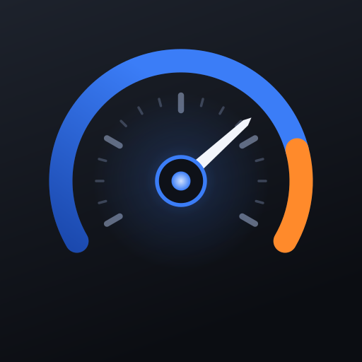

# Kobold

[](https://github.com/nphil/kobold/actions/workflows/ci.yml)
[](https://github.com/nphil/kobold/actions/workflows/release.yml)

A native SwiftUI OBD‑II dashboard for iOS — built to feel like a considered instrument, not a diagnostics utility. Clean, fast, and unmistakably itself.

**Install via Feather** — add this source:
`https://raw.githubusercontent.com/nphil/kobold/main/source.json`

The IPA is published **unsigned**; Feather signs it on-device with your own certificate, so no signing material ever goes near CI. See [docs/09](docs/09-ci-cd.md).

> **What works today:** the app opens into a live dashboard running in **demo mode** — a simulated ECU that answers real ELM327 frames, so the whole decode path runs on device. Talking to an actual adapter needs the BLE transport, which is the next piece of work.

> **Working codename:** *Kobold* — the household/mine spirit that Germanic miners blamed for the ore that "spoiled" their smelt; the ore turned out to be cobalt, and the spirit's name stuck to the element. A small, helpful presence living inside the machine, reading what the engine is doing and telling you plainly. The name is a placeholder — rename freely.

This repository contains the **architecture brief** (`docs/`) and the **first working slice of the app** (`Sources/`, `Tests/`). The brief is a synthesis of deep research into the open‑source OBD‑II ecosystem, the ELM327/BLE adapter landscape, a first real vehicle profile, iOS 120 fps rendering, a distinctive‑yet‑native design language, a 40‑theme theming system, and the realities of sideloaded distribution — it exists to *ease up the framework* so implementation starts from decisions already made and sourced.

## Status

| Layer | State |
|---|---|
| Transport contracts + replay transport | ✅ implemented, tested |
| ELM327 command loop (actor, serialised, adaptive timing) | ✅ implemented, tested |
| Response assembly, reply classification, ISO‑TP | ✅ implemented, tested |
| PID / DTC / supported‑PID decoding | ✅ implemented, tested |
| Vehicle profiles + inheritance + derived signals | ✅ implemented, tested |
| Signal bus (`@Observable`, per‑signal granularity) | ✅ implemented, tested |
| iOS app: dashboard, tachometer, demo mode | ✅ builds in CI, installable |
| CI/CD, semantic versioning, unsigned IPA, Feather source | ✅ live |
| BLE transport (CoreBluetooth, runtime GATT discovery) | ✅ implemented |
| Logging + diagnostics (OSLog, ntfy, frame counter) | ✅ implemented, tested |
| **Persistence (GRDB), full 40‑theme catalogue, charts** | ⬜ **next** |

**113 tests, 0 failures**, no compiler warnings. `KoboldCore` is pure Foundation — no CoreBluetooth, no SwiftUI — so it builds and tests on any platform including Linux CI:

```bash
swift build && swift test
```

The whole stack runs today against `ReplayTransport`, which serves canned adapter traffic fragmented into 20‑byte chunks exactly as a real BLE peripheral would. That means the decode path, profile engine, and signal bus are all exercised end to end **with no adapter and no car** — which matters more here than usual, since the target hardware sleeps when the app backgrounds and needs the engine running to answer most PIDs.

---

## The goal, in one paragraph

A clean, beautiful, native Swift/SwiftUI iOS app that renders live vehicle data as buttery‑smooth 120 fps gauges and graphs. The dashboard is modern and uncluttered — never overwhelming — but flexible enough to be tweaked by users who want depth. It has genuine visual character (it does not look like "yet another generic SwiftUI app") while following Apple's Human Interface Guidelines to the letter. It ships **20 light + 20 dark themes plus a match‑system mode**, where each theme meaningfully restyles the *entire* UI, not just an accent color. It targets, first, a common budget BLE adapter and one specific car — but **nothing about either is hardcoded**: the architecture is abstracted from day one so more adapters and vehicles are added as data, not code.

## Non‑negotiable requirements (the spec, distilled)

1. **Native and conventional.** SwiftUI, HIG‑compliant, standard navigation and gestures. Character lives in the *content* layer (gauges, graphs, numerals, motion), never in reinvented chrome. This is Apple's own iOS 26 doctrine, and it is also what every app we admire actually does.
2. **120 fps, genuinely.** ProMotion‑smooth gauges and live traces. This is an engineering requirement with concrete techniques (see [docs/05](docs/05-rendering-and-performance.md)), not an aspiration.
3. **Clean but flexible.** An uncluttered default that needs zero configuration, with progressive disclosure into real customization depth — the hybrid model users consistently prefer over both "locked preset" and "blank canvas" apps.
4. **Distinctive identity.** One signature idea, carried consistently. Instrument‑grade craft in the details. See [docs/06](docs/06-design-language.md).
5. **40 meaningful themes + match‑system.** A real theming *system* built on semantic design tokens, where gauge faces, needles, graph strokes, surfaces, and text all re‑theme together. See [docs/07](docs/07-theming-system.md).
6. **Abstraction over hardcoding.** A transport protocol, an adapter capability registry, and a data‑driven vehicle‑profile system. The first adapter and first car are *profile #1 and adapter #1* — reference data that proves the abstractions, never baked into the core or the UI. See [docs/02](docs/02-transport-and-adapters.md) and [docs/03](docs/03-vehicle-profiles-and-pids.md).

## How this research was produced

Orchestrated by Fable (synthesis and architecture) with a fleet of cheaper Sonnet/Haiku research agents running in parallel, each fetching and cross‑checking real sources (GitHub repos, the ELM327 datasheet, Apple docs, owner forums, App Review guidelines). A completeness critic then identified load‑bearing gaps — background BLE execution, CarPlay eligibility, and data persistence — which were closed by targeted follow‑up agents. Every load‑bearing claim (BLE UUIDs, extended PIDs with formulas, framework benchmarks) is sourced in the relevant chapter, and unverified claims are flagged as such.

---

## Documentation map

| # | Document | What it covers |
|---|---|---|
| 01 | [Open‑source landscape](docs/01-open-source-landscape.md) | The OBD‑II ecosystem, what to reuse vs. avoid, license hygiene, the one Swift‑native precedent worth forking from |
| 02 | [Transport & adapters](docs/02-transport-and-adapters.md) | ELM327 protocol, BLE/CoreBluetooth, the adapter abstraction, adapter #1 (a Vgate iCar Pro 2S) as reference data |
| 03 | [Vehicle profiles & PIDs](docs/03-vehicle-profiles-and-pids.md) | The data‑driven profile system, SAE J1979 baseline, profile #1 (a 2020 Genesis G70 2.0T) extended PIDs with formulas |
| 04 | [App architecture](docs/04-app-architecture.md) | The layered design end‑to‑end: transport → adapter driver → profile → signal bus → persistence → UI. Foreground execution model. |
| 05 | [Rendering & performance](docs/05-rendering-and-performance.md) | 120 fps ProMotion, Canvas gauges, Swift Charts limits + downsampling, @Observable granularity |
| 06 | [Design language](docs/06-design-language.md) | The distinctive‑yet‑native identity: the signature move, typography, motion, haptics, the anti‑patterns to avoid |
| 07 | [Theming system](docs/07-theming-system.md) | 40 themes + match‑system, generative OKLCH palettes, semantic tokens, picker UX |
| 08 | [Distribution & in‑car](docs/08-distribution-and-in-car.md) | Feather sideloading with your own cert, the CarPlay verdict, the phone‑mounted in‑car strategy |
| 09 | [CI/CD & releases](docs/09-ci-cd.md) | What runs on every push, automatic semantic versioning, why signing stays off GitHub |
| — | [reference/pid-reference.json](docs/reference/pid-reference.json) | A starter, machine‑readable PID table: SAE J1979 core + profile #1 extended PIDs |
| — | [reference/design-tokens.md](docs/reference/design-tokens.md) | The complete semantic design‑token vocabulary a gauge‑heavy app needs |

---

## Architecture at a glance

```
┌─────────────────────────────────────────────────────────────┐
│  Presentation (SwiftUI)                                      │
│  Dashboard · Gauges (Canvas) · Charts · Theme picker         │
│  reads ── ThemeStore (@Observable, @Entry env)               │
│  reads ── per-signal @Observable view-models                 │
├─────────────────────────────────────────────────────────────┤
│  Signal Bus                                                  │
│  one small @Observable object per live signal (RPM, speed…)  │
│  computed/derived signals (boost = MAP − baro)               │
├─────────────────────────────────────────────────────────────┤
│  Persistence (GRDB/SQLite)   ·   Sync (CloudKit, summaries)  │
│  wide Sample table + narrow EAV extras · Trip/DTC records    │
├─────────────────────────────────────────────────────────────┤
│  Vehicle Profile (data)                                      │
│  SAE J1979 baseline + per-make extended PID definitions      │
│  selected by VIN/user — NOT compiled in                      │
├─────────────────────────────────────────────────────────────┤
│  Adapter Driver (ELM327 command loop, actor)                 │
│  one command in flight · adaptive timing · multi-PID batching│
│  capability descriptors per adapter — NOT hardcoded          │
├─────────────────────────────────────────────────────────────┤
│  Transport (protocol)                                        │
│  BLE (CoreBluetooth) · WiFi · Demo/Replay                    │
│  dynamic GATT discovery — NOT hardcoded UUIDs                │
└─────────────────────────────────────────────────────────────┘
```

Three hard rules make "add more later" cheap and "meaningfully themed" true:

- **No hardcoded adapter.** Transport is a protocol; BLE GATT services are discovered at runtime; per‑adapter quirks live in capability descriptors. The first adapter is one row in a registry.
- **No hardcoded vehicle.** Standard PIDs work on any car; manufacturer extended PIDs are data (JSON), selected by VIN or user choice. The first car is one profile file.
- **No hardcoded color.** Every color in the app — including gauge faces, needles, tick marks, and graph strokes — routes through a semantic token. A component that hardcodes a color breaks theming the moment it renders, so the rule is enforced from the first commit.

## Key decisions already made (and why)

| Decision | Choice | Rationale (sourced in docs) |
|---|---|---|
| Reference to fork from | **SwiftOBD2** (MIT) | Only actively‑maintained Swift‑native OBD stack; ships a reusable JSON PID table and a SwiftUI demo. |
| Transport abstraction | Protocol + URL‑scheme style (à la CornucopiaStreams) | Lets BLE/WiFi/replay share one command layer. |
| Command loop | Swift `actor`, one command in flight, adaptive timing | Cleanest translation of ELMduino/AndrOBD/SwiftOBD2 patterns; avoids the ELM327 `STOPPED` pipelining bug. |
| Live‑data store | **GRDB/SQLite** | ~6–7× faster than Core Data on sample rows; real SQL for downsampling; SwiftData can't push aggregates and has documented bulk‑insert pitfalls. |
| Sync | CloudKit for **summaries only** | Raw samples would blow CKRecord limits, hit throttling, and eat the user's iCloud quota. |
| Gauges | **Canvas inside `TimelineView(.animation)`** | 500 SwiftUI shapes ≈ 12 fps; the same in one Canvas ≈ 60 fps. |
| Charts | Swift Charts with a **fixed window + LTTB downsampling** | Unbounded live arrays kill Swift Charts (fails at ~400 points); a bounded, downsampled window stays smooth. |
| Theming | **Generative OKLCH** seed configs → semantic tokens | Makes 40 coherent themes tractable and future themes a data entry. |
| Execution model | **Foreground‑only live sessions** | Both iOS background‑BLE limits *and* the adapter's own hibernation force this; trip gaps are modeled as segment boundaries. |
| CarPlay | **Out of scope** | The entitlement is Apple‑granted server‑side and un‑sideloadable; even if granted, CarPlay templates can't draw custom gauges. |
| In‑car UX | **Phone‑mounted dashboard** + Live Activities + StandBy | Unconstrained canvas, no entitlement, validated by shipping apps. |

## Distribution

The app is **sideloaded via Feather, signed with the developer's own paid Apple Developer certificate.** This means: 1‑year provisioning profiles (annual re‑sign, not weekly), App Groups available (so widgets and Live Activities share the live snapshot), no App Store review constraints, and background BLE, local notifications, WidgetKit and Live Activities all work. CarPlay is the one thing this cannot unlock — see [docs/08](docs/08-distribution-and-in-car.md) for the full verdict and the in‑car strategy that replaces it.

## Build order

1. ✅ **Transport + adapter driver + replay** — ELM327 command loop, with a replay transport so the rest is buildable without a car.
2. ✅ **Vehicle profile engine + SAE J1979 baseline** — decode standard PIDs on any car; profile #1 loaded as data.
3. ✅ **Signal bus** — per‑signal `@Observable` objects, derived signals.
4. ✅ **BLE transport** — CoreBluetooth implementation of `OBDTransport`, with runtime service discovery.
5. ✅ **Live history + charts** — bounded ring buffer per signal, LTTB downsampling, per‑signal history behind a tap.
6. ⬜ **Wider signal catalogue** — the profile ships **14 of ~80** standard Mode 01 PIDs. Missing and wanted: fuel level (`012F`), fuel rail pressure (`0122`/`0123` — interesting on a GDI turbo), fuel rate (`015E`), run time (`011F`), absolute load (`0143`), commanded lambda (`0144`), O₂ sensors, catalyst temps, bank‑2 trims. Also `tpmsPressure` (Mode 22 `C00B` via header `7A0`) is documented in [the PID reference](docs/reference/pid-reference.json) but never shipped — the one researched‑but‑unimplemented signal. **Do this from the car's own supported‑PID bitmask rather than by guessing**: `discoverSupportedPIDs()` already works, so enumerate what the vehicle reports and add entries for those, keeping the `knownAbsent` discipline for the rest. Gated on dashboard customisation, or more signals simply means more round trips and a slower per‑signal update rate.
7. ⬜ **Diagnostics screen** — trouble codes on **their own surface, never on the dashboard**. `readTroubleCodes()` (Mode 03) and `DTCDecoder` already exist and are tested; what is missing is UI plus the wider read modes. Scope: Mode 03 stored / 07 pending / 0A permanent, Mode 02 freeze frame, Mode 09 VIN and calibration. Clearing (Mode 04) is permitted — the security gateway blocks write‑class UDS but not DTC read/clear — but is destructive: it erases freeze frames and resets readiness monitors, so it needs a confirmation and a plain warning. Non‑engine module codes need `ATSH` header switching, which the research warns wants a genuine non‑clone chip, so detect and degrade rather than assume. Codes need real descriptions, with manufacturer‑specific ranges honest about being unknown rather than inventing text.
8. ⬜ **Design system + theming** — semantic tokens, the `ThemeStore`, a few themes end‑to‑end before scaling to 40. Needs a light‑mode pass first: every theme today assumes a dark background and the dashboard hardcodes `.preferredColorScheme(.dark)`.
9. ⬜ **Dashboard customisation** — choose, reorder and size the signals shown; the density ladder from full wall to Pure mode.
10. ⬜ **Adapter throughput** — multi‑PID batching and the expected‑response‑count digit ([docs/02](docs/02-transport-and-adapters.md)); currently one PID per round trip, ~14–15 PIDs/sec measured.
11. ⬜ **GRDB persistence** — wide+narrow sample schema; trip logging with segment boundaries.
12. ⬜ **In‑car surfaces** — Live Activity, StandBy layout, Guided‑Access‑friendly drive mode.

### Code layout

```
Sources/KoboldCore/
├── Transport/    OBDTransport protocol · ResponseAssembler · ReplayTransport
├── ELM327/       ELM327Driver (actor) · reply classification · ISO-TP · adaptive timing
├── Profile/      VehicleProfile · Conversion · PIDDecoder/DTCDecoder · ProfileStore
├── Signals/      SignalID/Unit · LiveSignal · SignalBus
├── Adapter/      AdapterDescriptor · AdapterRegistry
└── Resources/    profiles.json  ← the vehicle catalogue, as data

Sources/KoboldBLE/   CoreBluetooth transport — GATT profile discovered by role at runtime
Sources/KoboldLog/   Logger actor · ConsoleSink (OSLog) · NtfySink (batched remote)
```

### Debugging a build that lives in a car

The interesting failures happen with no Xcode in reach, so the app carries its
own instrumentation. **Diagnostics** (theme menu → Diagnostics) shows the
achieved frame rate against the display's maximum, the worst frame interval in
the last window, and the recent log buffer. It can also forward warnings and
errors to an [ntfy](https://ntfy.sh) topic, off by default.

> On the public ntfy server **the topic name is the password** — anyone who
> knows or guesses it can read everything published to it. Keep the random
> topic the app generates, or self-host. See [docs/04](docs/04-app-architecture.md#diagnostics--logging-out-of-a-device-you-cant-attach-a-debugger-to).

---

*This is a living brief. Sources are cited inline throughout the docs; claims that could not be verified are marked. Where the research found a genuine gap (e.g., undocumented AWD‑clutch PIDs for the reference car), it says so rather than inventing a value.*
